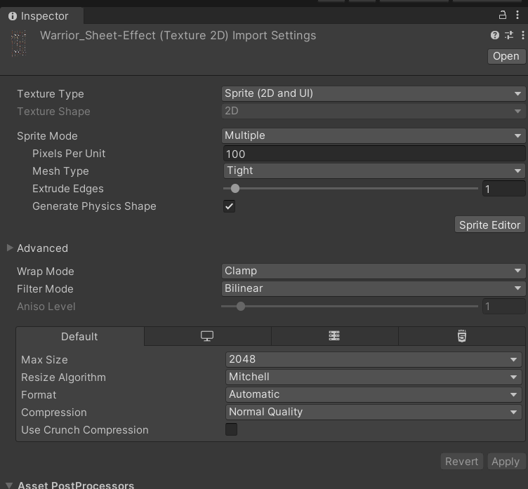
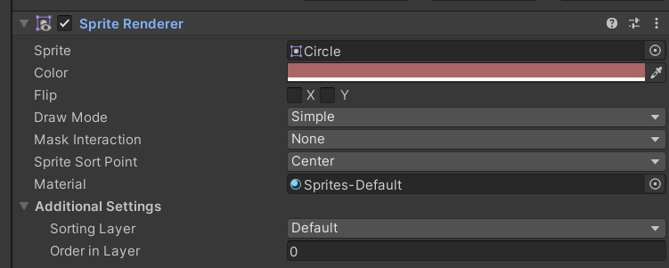

## Unity 的 Sprite Editor（精靈編輯器）
***
它的內部功能可以幫助開發者有效地管理和編輯 2D 精靈圖。以下是各內部功能的詳細解釋：
***

1. Sprite Editor 總覽

	Sprite Editor 是一個圖像編輯工具，允許你在 Unity 內部編輯 2D 精靈。常用於將一張大型的圖像（例如一個角色動作表或場景背景）分割成多個小圖，或對精靈的邊框、樞軸點等屬性進行調整。
	
	1.1 Texture Type（材質類型）
	Texture Type 允許你設定圖像的用途和渲染方式。常見選項如下：

	* Single（單一精靈圖）：用於單一的精靈圖，不需要分割圖像。
	* Multiple（多重精靈圖）：用於精靈圖集，可以將大圖像分割成多個小的精靈圖，適用於動畫或圖像圖集。
	* Sprite (2D and UI)：專門用於 2D 遊戲和 UI 元素的精靈圖。
	* 選擇不同的 Texture Type 將會影響精靈的渲染方式及精靈編輯器的操作模式。

	1.2 Sprite Mode（精靈模式）
	Sprite Mode 决定一個材質如何在遊戲中被切割與使用：

	* Single（單精靈）：表示這個圖像只包含一個精靈。
	* Multiple（多精靈）：允許你將一張大圖分割成多個小的精靈圖，以便在遊戲中使用精靈動畫或其他資源。
	
	1.3 Packing Tag（打包標籤）

	Packing Tag 用來將精靈打包到 Sprite Atlas（精靈圖集）中，通過將多個精靈圖打包在一起來優化性能。這可以減少渲染時的材質切換次數，從而提升遊戲的效率。你可以給精靈圖加上標籤，這樣 Unity 在構建時會自動把帶有相同標籤的精靈圖打包在一起。

	1.4 Pixels Per Unit（每單位像素數）

	Pixels Per Unit 設定的是精靈圖在場景中一個世界單位（Unity 的 1 單位）的長度對應多少像素。這個數值決定了精靈圖在場景中的物理尺寸：

	如果設置為 100，則表示 100 像素等於 Unity 中的 1 單位。
	對於精靈的縮放、碰撞形狀、物理運算等有重要影響。

	1.5 Mesh Type（網格類型）
	Mesh Type 定義精靈圖如何使用網格進行渲染，有兩種選項：

	* Tight（緊密型）：Unity 會自動生成一個緊密貼合精靈圖像內容的多邊形網格，這樣可以減少無用的透明像素區域，優化渲染。
	* Full Rect（完整矩形）：使用完整的矩形網格，包含整個圖像的範圍，這對於某些特殊情況更適合。
	
	1.6 Pivot（樞軸點）
	Pivot 是精靈圖的旋轉或縮放的中心點。在精靈編輯器中，你可以調整這個樞軸點的位置，並選擇預設值或手動設置。樞軸點的重要性在於它影響：

	精靈圖的旋轉中心
	遊戲中的對齊方式
	動畫製作時的基準點

	1.7 Extrude Edges（邊緣擠出）

	Extrude Edges 功能適用於多邊形網格渲染模式時。當精靈圖的邊緣與其他精靈圖相鄰時，它會擠出精靈圖的邊緣，以避免邊緣出現撕裂或接縫問題，確保精靈圖顯示的連續性。

	1.8 Sprite Atlas（精靈圖集）

	Sprite Atlas 是一個用於將多個精靈圖合併到單一圖集中以提升渲染效率的工具。通過將多個小精靈圖合併為一個大的圖像，Unity 可以減少渲染時的材質切換，從而加快遊戲性能。

	1.9 Generate Physics Shape（生成物理形狀）

	如果你選擇啟用物理引擎，Unity 可以自動根據精靈圖的形狀生成一個相應的碰撞形狀。這樣在物理系統中，碰撞範圍會更準確，這個功能對於需要準確碰撞檢測的遊戲尤為重要。你還可以手動調整這些物理形狀。

	1.10 Secondary Textures（次級材質）

	Secondary Textures 允許你為精靈圖添加次級材質，例如法線貼圖（Normal Maps）、遮擋貼圖（Occlusion Maps）等。這對於在 2D 遊戲中加入更多光照效果和細節非常有幫助。

	1.11 Alpha Source（透明源）

	Alpha Source 決定透明度是從哪裡來的。你可以選擇從圖像的 Alpha 通道提取透明度，或者使用其他方法來定義精靈圖的透明部分。這對於精靈的顯示效果至關重要，特別是處理具有不同透明度級別的圖像。

	1.12 Wrap Mode（包裹模式）

	Wrap Mode 控制當精靈圖在渲染時超出其邊界的行為方式：

	* Repeat（重複）：精靈圖將會重複顯示，用於像是背景圖的無縫拼接。
	* Clamp（夾邊）：精靈圖將不會重複，圖像邊緣會被延伸。
	
	1.13 Filter Mode（過濾模式）
	Filter Mode 設定精靈圖在縮放時的顯示效果：

	* Point（點過濾）：最適合像素風格遊戲，圖像縮放後仍然保持銳利的像素感。
	* Bilinear（雙線性過濾）：圖像縮放時會進行平滑處理，適合高解析度圖像。
	* Trilinear（三線性過濾）：類似於雙線性過濾，但針對更高級的多層紋理進行過濾。
	
	1.14 Mip Maps（多級細緻紋理）

	Mip Maps 是一種優化技術，能夠在圖像縮小時顯示一個更低解析度的版本。這樣可以減少遠距離渲染時的顆粒感和性能消耗。

2. Slice（切割）
* Slice 是用來將一張精靈圖表（如動畫精靈或圖塊）切割成多個小圖。你可以根據不同需求選擇切割方式：

* Automatic（自動切割）：Unity 根據圖像中的透明像素自動進行切割，適合使用含有透明背景的圖片。
* Grid by Cell Size（依據網格大小切割）：你可以手動設定每個小圖的固定寬高，這種方式適合像素圖或預設尺寸的圖像。
* Grid by Cell Count（依據單元格數量切割）：你可以指定要將圖片切割成多少行或多少列，適合統一分割的精靈圖表。
* Manual（手動切割）：開發者可以自由繪製邊框來決定每個精靈的範圍。

3. Trim（裁剪）

	Trim 功能會自動去除每個精靈圖的透明邊框部分，將精靈圖裁剪成最小的有效區域，這樣可以減少圖像大小，提高遊戲的渲染效率。

4. Custom Pivot（自訂樞軸點）

	每個精靈圖都有一個 Pivot（樞軸點），這個點是精靈旋轉或縮放時的參考點。你可以手動設定這個樞軸點的位置，或者使用預設的選項（如中心點、左下角、右上角等）。這在動畫中尤其重要，因為樞軸點會影響動畫的表現。

5. Border（邊界）

	在 9-slice scaling（九宮格縮放）中，你可以定義精靈圖的邊界。這種方式適用於那些需要縮放而不失真（例如 UI 按鈕）的圖像。邊界設置允許你固定精靈圖的四個角，而將中間部分自由拉伸。

6. Physics Shape（物理形狀）

	精靈圖還可以用來生成物理碰撞形狀。在 Sprite Editor 中，你可以手動調整精靈圖的物理碰撞形狀，以使其更準確地與圖片匹配。這個功能常用於碰撞檢測或物理系統中，確保精靈圖的邊界準確反映其外形。

7. Padding（間距）

	當你需要切割精靈圖表時，可以設置間距來調整精靈之間的距離。這可以避免因為圖像太緊密而導致的渲染問題，特別是在處理具有相似顏色的圖像時。

8. Texture Type & Packing Tag（材質類型與打包標籤）
* Texture Type：你可以設置精靈圖的材質類型，像是 Single（單精靈圖）或 Multiple（多精靈圖），具體設定會影響圖像如何顯示和渲染。
* Packing Tag：如果你使用了 Sprite Atlas（精靈圖集），可以將精靈圖打包到同一個圖集中，這樣可以減少渲染時的性能開銷。設定 Packing Tag 可以讓精靈圖自動打包到特定圖集中。
9. Polygonal vs Rectangular Sprites（多邊形 vs 矩形精靈）

	在某些情況下，你可能需要更精細的碰撞形狀。例如，對於不規則形狀的精靈圖，Unity 提供多邊形精靈選項，可以生成一個更符合圖像輪廓的碰撞區域，而不是矩形。

---

## Unity Sprite Import Settings 的面板
***

***

1. Texture Type（材質類型）
	Texture Type 定義圖像的用途：

	Sprite (2D and UI): 用於 2D 精靈圖和 UI 圖像，特別適合 2D 遊戲和使用 UI 元件。
	其他選項通常還包括 3D 遊戲中的標準材質（如 Normal Map 等），但在 2D 精靈設置中最常用的就是此選項。

2. Texture Shape（材質形狀）

	2D：這個選項顯示材質將作為 2D 資源使用，因為這是 2D 精靈圖，因此只能選擇此選項。

3. Sprite Mode（精靈模式）

	Sprite Mode 定義材質如何使用精靈：

	* Single（單精靈）：一張精靈圖表示一個圖像，適用於單一精靈。
	* Multiple（多精靈）：允許你將一張圖像切割成多個精靈圖，通常用於動畫精靈圖表或精靈圖集。

4. Pixels Per Unit（每單位像素數）
定義圖像中多少像素代表 Unity 世界中的一個單位：

100 是常見的預設值，表示每 100 像素等於 1 單位的長度。
這個值影響精靈在場景中的大小和碰撞範圍。

5. Mesh Type（網格類型）

	定義精靈圖如何生成網格：

	* Tight（緊密型）：精靈圖會生成一個多邊形網格，緊密貼合精靈的邊緣，減少不必要的透明部分。
	* Full Rect（完整矩形）：會生成一個矩形網格，包含整個精靈圖像，通常對於需要完全顯示圖像的應用更合適。

6. Extrude Edges（邊緣擠出）

	此滑動條定義擠出精靈邊緣的距離。擠出會將精靈的邊緣延伸，以防止在貼合時顯示邊界撕裂。滑動條的值越大，擠出越明顯。

7. Generate Physics Shape（生成物理形狀）

	啟用此選項後，Unity 將自動根據精靈的形狀生成碰撞形狀，這對於物理引擎中的碰撞檢測非常有用。

8. Sprite Editor（精靈編輯器）

	按下此按鈕將打開 精靈編輯器，可以在其中對精靈圖進行手動切割、設置樞軸點或調整其他精靈圖屬性。

Advanced（進階設置）

9. Wrap Mode（包裹模式）
	定義當精靈圖超出邊界時的渲染行為：

	* Clamp（夾邊）：當精靈超出邊界時，圖像的邊緣將被延伸而不重複，這通常適用於需要邊界平滑過渡的精靈圖。
	* Repeat（重複）：超出邊界後圖像會重複，適合無縫拼接的背景圖或紋理。
	
10. Filter Mode（過濾模式）
	
	定義精靈圖在縮放時的顯示效果：

	* Point（點過濾）：無平滑處理，保持像素風格，適合像素藝術遊戲。
	* Bilinear（雙線性過濾）：當精靈縮放時會進行平滑處理，適合高解析度圖像。
	* Trilinear（三線性過濾）：在多層次的圖像上使用更高級的過濾效果，適合有多級紋理的圖像。
	
11. Aniso Level（各向異性過濾等級）
	
此設置影響精靈圖在斜角上觀看時的清晰度：

值越高，圖像在不同視角下的清晰度越好，但也會消耗更多性能。對於 2D 圖像，通常保持此設置為較低值。

12. Max Size（最大尺寸）
定義精靈圖的最大解析度。當精靈圖大於此值時，Unity 會自動縮小圖像以符合此限制。

2048 是常見的預設值，適用於大多數精靈圖。

13. Resize Algorithm（縮放算法）
定義 Unity 如何縮放圖像：

* Mitchell：一種高品質的縮放算法，適合需要高精度縮放的情況。
其他選項可能會包括 Bilinear 或 Nearest Neighbor，視需要選擇不同的縮放算法。

14. Format（格式）
定義精靈圖的圖像格式：

* Automatic（自動）：Unity 根據平台自動選擇合適的圖像格式。
你也可以手動選擇其他壓縮格式（如 PNG、JPEG 等），這會影響圖像質量和存儲大小。

15. Compression（壓縮）
定義精靈圖的壓縮質量：

* None（無）：不進行壓縮，圖像保留最高質量，但佔用的內存也最多。
* Normal Quality（正常質量）：對圖像進行適度壓縮，以節省空間，通常不會影響畫質。
* High Quality（高質量）：壓縮後畫質保留更多細節，但壓縮效果較小。
* Low Quality（低質量）：壓縮率高，但可能會損失圖像細節。

16. Use Crunch Compression（使用 Crunch 壓縮）
Crunch Compression 是一種高效的壓縮算法，適用於減小文件大小，尤其在處理大規模精靈圖集時可以顯著減少內存佔用。但壓縮過程耗時，並且在某些情況下可能會降低圖像質量。

## Sprite Renderer
***

***

# Unity Sprite Renderer 組件解釋

## 1. Sprite
- **功能**：`Sprite` 指定了要渲染的 2D 圖像。當你選擇一個圖後，Unity 會自動將這個精靈圖加載到場景中進行渲染。
- **內部機制**：Unity 會將你選擇的圖加載到 GPU 上，並使用 **Sprite Renderer** 組件來進行繪製。此過程使用了圖的 UV 座標來正確定位和顯示圖像。

## 2. Color（顏色）
- **功能**：通過調整 `Color`，你可以改變顏色。RGBA 模式允許你控制紅、綠、藍三種顏色及其透明度（Alpha）。
- **內部機制**：Unity 在渲染圖像時，會將此顏色與圖的每個像素進行混合。默認情況下是白色（無更改），而其他顏色會影響顯示結果，例如給圖像增加顏色覆蓋或透明度。

## 3. Flip（翻轉）
- **功能**：`Flip X` 和 `Flip Y` 分別控制在 X 軸和 Y 軸上水平和垂直翻轉圖。
- **內部機制**：Unity 通過改變精靈的 UV 座標來實現翻轉。在 X 軸上翻轉時，它會將 UV 座標的 X 值取反；同樣，在 Y 軸上翻轉時，它會將 UV 座標的 Y 值取反，從而實現鏡像效果。

## 4. Draw Mode（繪製模式）
- **功能**：`Draw Mode` 決定如何繪製圖，有三個選項：
  - **Simple（簡單）**：使用原始的圖大小進行繪製。
  - **Sliced（切割）**：適用於九宮格圖像，允許在保持四角不變的情況下拉伸中心部分。
  - **Tiled（平鋪）**：將圖像平鋪以填充指定的區域，適合用來創建無縫背景。
- **內部機制**：Unity 根據你選擇的模式來調整網格的 UV 和頂點座標，進而改變圖像的顯示方式。

## 5. Mask Interaction（遮罩交互）
- **功能**：`Mask Interaction` 控制與遮罩（如 UI 遮罩或其他渲染遮罩）的互動方式：
  - **None（無）**：不會與任何遮罩進行交互。
  - **Visible Inside Mask（遮罩內可見）**：只有在遮罩內的部分會顯示出來。
  - **Visible Outside Mask（遮罩外可見）**：只有遮罩外的部分會顯示出來。
- **內部機制**：Unity 使用遮罩的 Alpha 值來決定的可見性。如果遮罩的某部分為透明，則精靈圖的對應部分將被隱藏。

## 6. Sprite Sort Point（排序點）
- **功能**：`Sprite Sort Point` 定義了用來進行深度排序（在場景中的前後順序）的參考點：
  - **Center（中心）**：使用中心作為排序依據。
  - **Pivot（樞軸點）**：使用在編輯器中設置的樞軸點作為排序依據。
- **內部機制**：Unity 在進行深度排序時，會根據所選的排序點來計算精靈的 Z 值，從而決定在渲染隊列中的優先級。

## 7. Material（材質）
- **功能**：`Material` 決定圖使用的材質。默認使用的是 **Sprites-Default** 材質，它是一個標準的 2D 精靈材質。
- **內部機制**：材質控制了如何渲染圖像，包括光照、紋理貼圖、著色器效果等。不同的材質可以使用不同的著色器來創建各種視覺效果，如發光、陰影、反射等。

---

## Additional Settings（附加設置）

### 8. Sorting Layer（排序圖層）
- **功能**：`Sorting Layer` 決定了在 2D 場景中的渲染順序。圖層的順序從下至上，數值較大的圖層會覆蓋在數值較小的圖層之上。
- **內部機制**：Unity 會根據 `Sorting Layer` 的層級來排列所有精靈圖的渲染順序，確保在同一個層級中對象的正確顯示。

### 9. Order in Layer（圖層順序）
- **功能**：`Order in Layer` 決定了在同一 `Sorting Layer` 中的顯示順序。值越大，將渲染得越靠前，覆蓋其他值較小的。
- **內部機制**：Unity 會在每個 `Sorting Layer` 內進行二次排序，使用 `Order in Layer` 作為參考值來決定精靈的顯示順序。
