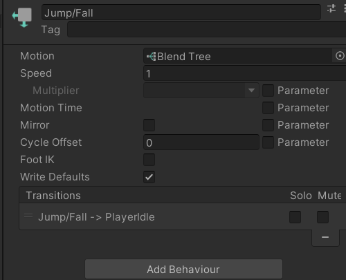

# Unity Blend Tree 和 動畫狀態機 詳細解釋

## 1. Blend Tree 的內部機制

### Blend Tree 概述
**Blend Tree** 是 Unity 動畫系統的一部分，允許平滑過渡和混合多個動畫，根據某些參數（如速度、方向等）來動態調整角色的動畫狀態。這對於處理複雜的動作，如跳躍、跑步或轉彎時的過渡非常有用。

### yVelocity 控制的內部機制
在該 Blend Tree 中，`yVelocity` 參數被用來決定角色的垂直速度：

- **正值的 yVelocity** 表示角色在上升（跳躍），因此 Blend Tree 將過渡到 **PlayerJump** 動畫。
- **負值的 yVelocity** 表示角色在下降，因此 Blend Tree 將過渡到 **PlayerFall** 動畫。
  
當 Blend Tree 接收到 `yVelocity` 的更新值時，它會根據設置的閾值（Threshold）動態混合兩個動畫，以確保動畫過渡的自然和平滑。

### PlayerJump 和 PlayerFall 的內部切換機制
Blend Tree 根據 `yVelocity` 的範圍來選擇合適的動畫。Unity 通過內部的加權算法來確定兩個動畫的混合比例。如果 `yVelocity` 介於 -1 和 1 之間，Unity 會逐漸從 PlayerFall 過渡到 PlayerJump 或反之。這樣避免了瞬間的動畫切換，從而增強了遊戲中的自然感。

---

## 2. 動畫狀態機（Animator State Machine）內部機制

### 狀態切換的工作原理
在 Unity 的 Animator 中，狀態機管理著動畫之間的切換。當角色的參數（如 `yVelocity`）達到某個閾值時，狀態機會觸發一個狀態過渡，從當前動畫切換到新的動畫。

- **Transition（過渡）**:
  - 過渡是 Unity 中動畫狀態之間的自動切換。當滿足一定條件時（例如 `yVelocity` 變為 0），狀態機將從 `Jump/Fall` 過渡到其他狀態（如 `PlayerIdle`）。
  - 過渡內部依賴於 Unity 的一套條件系統，根據設定的參數變化來決定過渡是否觸發。當參數達到過渡設定的閾值時，系統會自動進行動畫切換。

### Foot IK 的機制
`Foot IK` 的作用是保持角色雙腳在地面上。當角色進行跳躍或其他運動時，Foot IK 確保腳部不會穿透地面或懸空。Unity 使用逆向運動學（Inverse Kinematics, IK）計算角色腳的位置，並根據場景中的地形動態調整角色腳的姿態，實現更逼真的效果。

---

## 3. Blend Tree Inspector 設置的內部機制

### Threshold 計算機制
Blend Tree 中的 **Thresholds（閾值）** 決定了動畫何時開始過渡。每一個閾值與參數值（如 `yVelocity`）對應。當 `yVelocity` 在指定範圍內變化時，Unity 將根據該範圍內的值，動態計算兩個動畫之間的混合比例。

例如：
- 當 `yVelocity` 接近 1 時，PlayerJump 動畫會逐漸占主導地位，而 PlayerFall 的影響會減弱。
- 當 `yVelocity` 接近 -1 時，PlayerFall 動畫會占主導地位。

### 自動閾值的機制
如果啟用了 **Automate Thresholds**，Unity 會根據動畫的順序自動設置閾值，而不需要手動調整。這使用內部算法，將動畫按線性比例自動分配給參數範圍。這種自動化的過程降低了手動設置的複雜性，適合需要快速設定的簡單動畫過渡。
