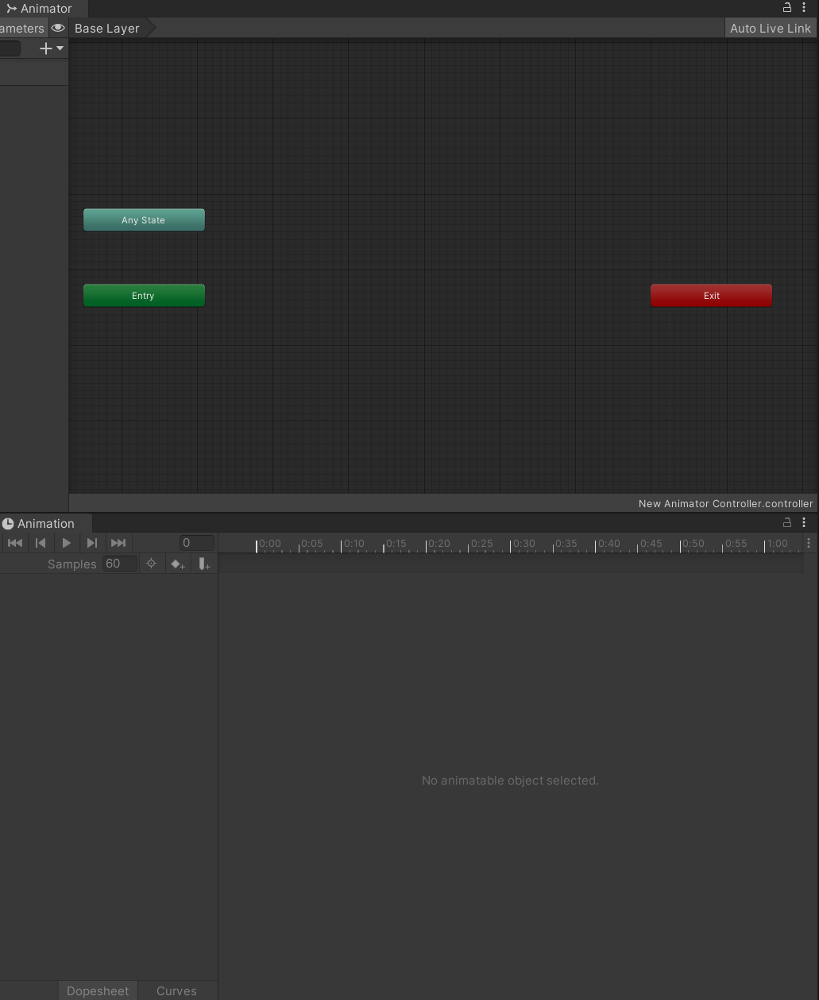

# Unity Animator 和 Animation 

## Animator 視窗

### 1. **Animator 狀態機**
   - **Base Layer**: 
     - 動畫控制器的基礎層，用來定義所有動畫狀態及轉換。每一層都可以獨立處理動畫邏輯。
     - 當使用多層時，較上層的動畫會覆蓋下層。可以用於處理複雜角色動畫，例如：一層控制身體動畫，另一層控制面部表情。
     - **內部機制**: 當你在多層中使用動畫時，每個層都有自己的權重控制，這會決定哪一層的動畫效果最終展示在角色上。高層級動畫的權重通常覆蓋底層動畫。

   - **Any State**: 
     - 表示任意狀態皆可從此處跳轉到其他狀態，無需先進入特定狀態。這非常有用於中斷當前動畫並立刻進入關鍵動畫，如死亡或受擊動畫。
     - **內部機制**: 當條件滿足時，`Any State` 可以跳過其他正在播放的狀態，直接觸發動畫。這對於高優先級的動畫（如突發事件動畫）非常重要。

   - **Entry**: 
     - 表示動畫的進入點，這是動畫控制器啟動後的第一個狀態，通常用於設定角色的默認動畫狀態，例如待機狀態。

   - **Exit**: 
     - 退出狀態，當進入此狀態後，該動畫狀態機將結束。通常用於結束動畫過程或作為某些觸發條件的終止狀態。

### 2. **Animator 右上角功能**
   - **Auto Live Link**: 
     - 允許在不需要點擊 Play 的情況下實時查看動畫效果。這是用來快速調整動畫的便捷功能。
   - **參數管理（Parameters）**: 
     - **+ 號按鈕**：用來新增參數。這些參數可以在狀態之間轉換時使用。參數類型：
       - **Float**: 浮點數，用於持續變化的數據（如角色速度）。
       - **Int**: 整數，通常用於記錄狀態，例如攻擊的階段。
       - **Bool**: 布林值，通常用來表示某個開關狀態（如角色是否在跳躍中）。
       - **Trigger**: 觸發器，用於啟動一次性動作（如攻擊動作的開始）。
     - **內部機制**: 每當參數被更改，動畫控制器會自動檢查所有相關的過渡條件並進行動畫狀態轉換。例如，如果某個 `Bool` 被設置為 `true`，則會檢查對應條件並觸發相應的動畫過渡。

### 3. **動畫過渡和條件**
   - **過渡（Transition）**: 
     - 動畫狀態之間的過渡可以通過右鍵點擊某一狀態並選擇 “Make Transition” 來創建。過渡是控制兩個動畫狀態如何切換的橋樑。
     - 過渡期間可以設置平滑過渡的時間長度，避免動畫之間突然跳變。
     - **內部機制**: 在動畫狀態過渡期間，Unity 會根據設置的過渡時間平滑地插值兩個動畫狀態，讓它們以指定的速度過渡。這避免了動畫之間的突兀跳轉。

   - **條件（Conditions）**: 
     - 過渡可以根據參數來設置條件。例如：只有當參數 "isJumping" 為 `true` 時，才會從待機狀態切換到跳躍狀態。
     - 可以在狀態間過渡的條件面板中設置條件。
     - **內部機制**: 條件是基於參數進行監控的，當參數滿足設置的條件時，對應的動畫過渡就會被觸發。這使得動畫系統具有高度的靈活性。

### 4. **右鍵功能選單**
   - **Create State**: 
     - 用來建立新的動畫狀態。
     - **Empty**: 建立一個空的狀態。
     - **From New Blend Tree**: 創建一個新的 Blend Tree 狀態，用於混合多個動畫。
     - **內部機制**: Blend Tree 通過將多個動畫根據不同的參數進行混合，產生平滑的動畫過渡。Unity 根據輸入的參數動態計算每個動畫的權重，並在運行時進行實時混合。
   
   - **Create Sub-State Machine**: 創建一個子狀態機。子狀態機用來組織和管理大型動畫控制器中的動畫邏輯，例如可以將角色的上半身和下半身的動畫邏輯分開處理。

   - **Set As Layer Default State**: 設定此狀態為該層的默認狀態，動畫從此處開始播放。

   - **Copy / Paste / Delete**: 用於複製、粘貼或刪除選中的狀態或過渡。

   - **Add Transition**: 用來手動添加狀態之間的過渡，當需要控制不同動畫之間的切換邏輯時非常有用。

   - **Toggle Mute**: 暫時靜音動畫狀態，避免動畫影響其他狀態的調試。

## Animation 視窗

### 1. **Animation Clip 編輯區**
   - **Dopesheet（關鍵幀表）**: 
     - Dopesheet 模式下，可以手動為動畫的不同屬性（如位置、旋轉、縮放等）創建關鍵幀。透過拖動時間軸，可以在不同時間點上進行編輯。
     - **內部機制**: Dopesheet 會以關鍵幀的形式儲存每個動畫幀的屬性變化，Unity 在運行時會自動補全這些關鍵幀之間的值，從而產生流暢的動畫效果。

   - **Curves（曲線編輯）**: 
     - 在 Curves 模式下，可以精確控制動畫參數（如移動、旋轉）的變化曲線，讓動畫過渡更加平滑或具有彈性。
     - **內部機制**: 曲線編輯允許動畫師控制動畫的變化速度。曲線的形狀決定了屬性的加速或減速效果，從而實現如彈性移動、緩動等效果。

### 2. **Samples（取樣率）**
   - **Samples**: 用來控制動畫的取樣率（幀速率），這會影響動畫播放的平滑度。例如，60 表示每秒播放 60 幀。取樣率越高，動畫會顯得越流暢，但也會增加處理負擔。
   - **內部機制**: 動畫取樣率會影響 Unity 如何在每秒內播放指定的幀數。高取樣率的動畫通常需要更多的資源來渲染和處理，但也可以提供更細緻的動畫效果。

### 3. **功能選單**
   - **Add Property**: 
     - 可以為當前選中的物體添加一個可動畫化的屬性（如位置、旋轉、縮放）。這些屬性會顯示在 Dopesheet 或 Curves 中，並且可以設定關鍵幀。
     - **內部機制**: 當添加屬性後，Unity 會將這些屬性加入到動畫剪輯中並將其儲存在關鍵幀數據中。這使得物件的這些屬性可以隨著時間變化而被動畫控制。

   - **Animation Settings**: 
     - 用於調整當前動畫剪輯的設置，包括樣本速率、動畫時長、回放模式（如循環播放）等。
   
   - **Copy / Paste**: 
     - 可以複製和粘貼已創建的關鍵幀，使得編輯動畫變得更加快速。

   - **Create New Clip**: 
     - 創建新的動畫片段（Clip），通常用來定義角色的特定行為（如跑步、跳躍等）。

   - **Keyframe 操作**:
     - **Insert Keyframe**: 手動插入關鍵幀。
     - **Delete Keyframe**: 刪除當前選中的關鍵幀。

### 4. **播放控制**
   - **Play**: 
     - 播放當前動畫片段，可以預覽編輯效果。
   
   - **Record**: 
     - 點擊錄製按鈕後，當修改動畫物件的屬性時，會自動記錄下新的關鍵幀。

### 5. **Hierarchy（層級）連結**
   - 當選擇場景中的一個可動畫化的物件後，Animation 視窗會顯示該物件的動畫剪輯。

### 6. **No Animatable Object Selected**
   - 當沒有選擇任何具有動畫的物體時，Animation 視窗會顯示此提示。

## 動畫過渡設定

當你選擇一個動畫狀態的過渡時，Inspector 視窗會顯示該過渡的詳細設定。

### 1. **Transitions（過渡列表）**
   - **Solo**: 
     - 如果勾選，該過渡會單獨運行，其他過渡會被忽略。適合需要優先觸發的動畫過渡。
     - **內部機制**: Solo 過渡的優先級會高於其他所有過渡，無論其他過渡的條件是否滿足，系統都會先執行這個過渡。
   
   - **Mute**: 
     - 使該過渡無效，不會再發生轉換。這對於調試動畫非常有幫助，可以禁用某些過渡來觀察動畫的表現。
     - **內部機制**: 當一個過渡被靜音時，該過渡將不會被檢查條件，因此無法觸發對應的動畫切換。

### 2. **過渡設定（Transition Settings）**

   - **Has Exit Time**: 
     - 如果勾選，這個過渡只有在動畫片段播放到一定時間（通常是結束）後才會發生過渡。
     - **內部機制**: 當 `Has Exit Time` 被啟用，Unity 會根據動畫片段的播放進度來決定是否可以過渡到下一個狀態。這常用於自然過渡，例如讓角色的走路動作播放完畢後再轉換成跑步動作。

   - **Exit Time**: 
     - 設定當前動畫片段播放到何時觸發過渡，通常使用百分比或實際時間。例如，`0.583` 表示動畫片段播放到 58.3% 時發生過渡。
     - **內部機制**: 當 `Exit Time` 設定為小於 1 的值時，動畫過渡會在該時間點觸發，不會等到動畫片段完全播放完畢。

   - **Fixed Duration**: 
     - 如果勾選，過渡的時間將是固定的，不受當前動畫片段長度影響。取消勾選後，過渡時間將基於動畫片段的長度比例來計算。
     - **內部機制**: 使用固定持續時間會使過渡過程更加一致，無論動畫片段的長短為何，過渡時間都會保持穩定。

   - **Transition Duration**: 
     - 定義過渡的持續時間（秒），過渡越長，兩個動畫狀態之間的切換越平滑。通常，用於避免動畫切換時的突然跳變。
     - **內部機制**: Unity 在過渡期間會對兩個動畫狀態進行插值，使兩個動畫平滑地混合。在過渡時間內，兩個動畫會同時播放，權重會逐漸從一個動畫轉移到另一個。

   - **Transition Offset**: 
     - 定義下一個動畫片段從哪個時間點開始播放。例如，設置 0.5 意味著過渡到下一個動畫片段時，會從該片段的 50% 開始播放。
     - **內部機制**: 當過渡有偏移量時，下一個動畫片段不會從頭開始，而是從設定的時間點開始播放。這有助於創建更具動態的動畫過渡。

   - **Interruption Source**: 
     - 設置是否允許當前過渡被另一個過渡中斷。選項包括：
       - **None**: 不允許中斷。
       - **Current State**: 當前動畫狀態可以被中斷。
       - **Next State**: 下一個動畫狀態可以被中斷。
     - **內部機制**: 當允許中斷時，如果另一個動畫過渡的條件滿足，則可以立即切換至下一個狀態，而不必等當前過渡完成。

   - **Ordered Interruption**: 
     - 如果勾選，過渡會按照設定的順序被中斷，這可以避免過渡在不合理的時間點被中斷。
     - **內部機制**: 順序中斷確保動畫過渡的流程更加可控，避免一些不必要的過渡中斷，從而保持動畫邏輯的完整性。

### 3. **條件（Conditions）**
   - **條件列表**: 
     - 定義過渡發生的條件。這些條件通常依賴於參數值。例如，在圖片中，當 `isMoving` 為 `true` 時，才會從 `PlayerIdle` 過渡到 `PlayerMove` 狀態。
     - **內部機制**: 每次參數值變更時，動畫系統會檢查所有過渡條件是否滿足。如果條件滿足，對應的過渡就會被觸發。

   - **+ 按鈕**: 
     - 可以用來添加更多條件來控制過渡發生的複雜性。例如，你可以設定當 `isMoving` 為 `true` 並且 `speed > 5` 時才進行過渡。

